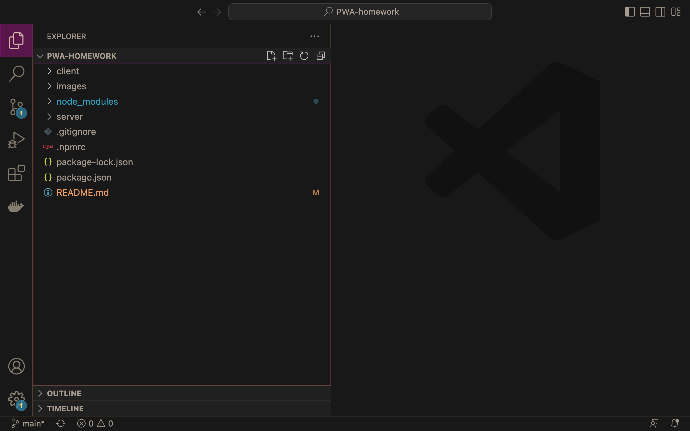
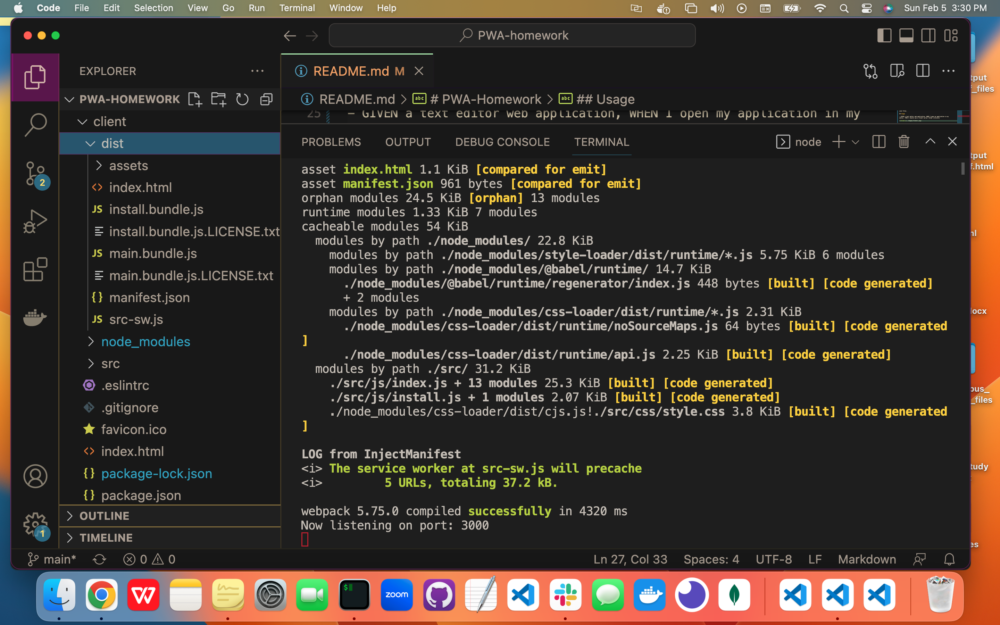
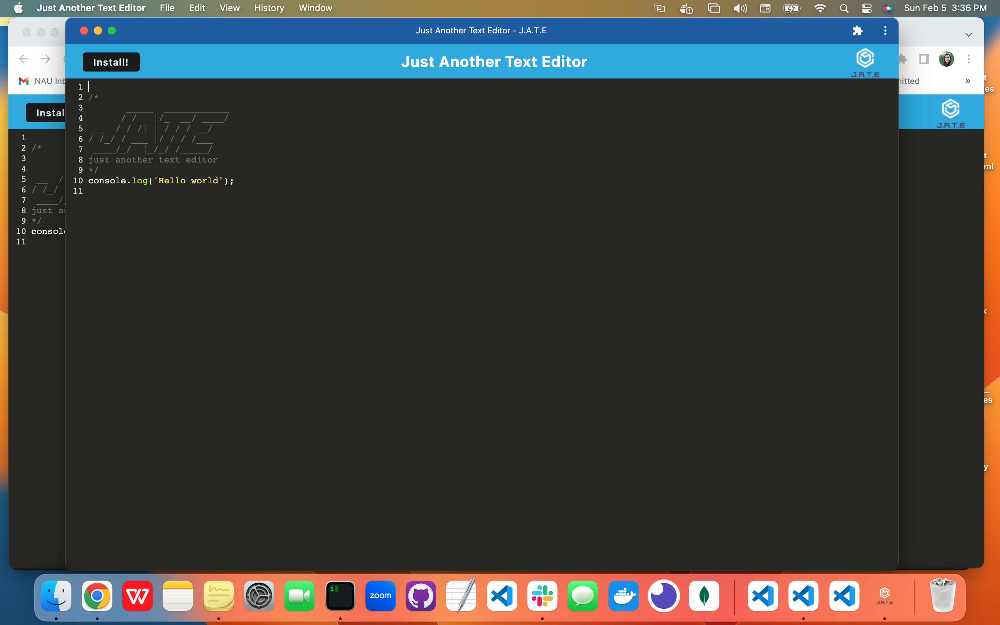
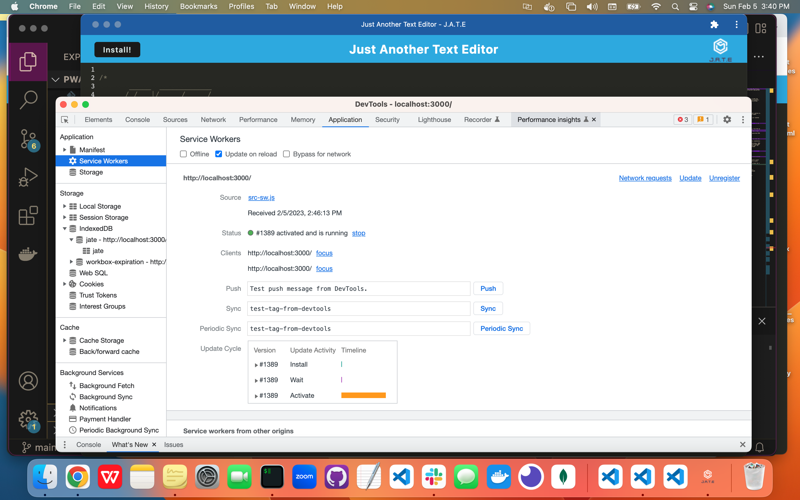
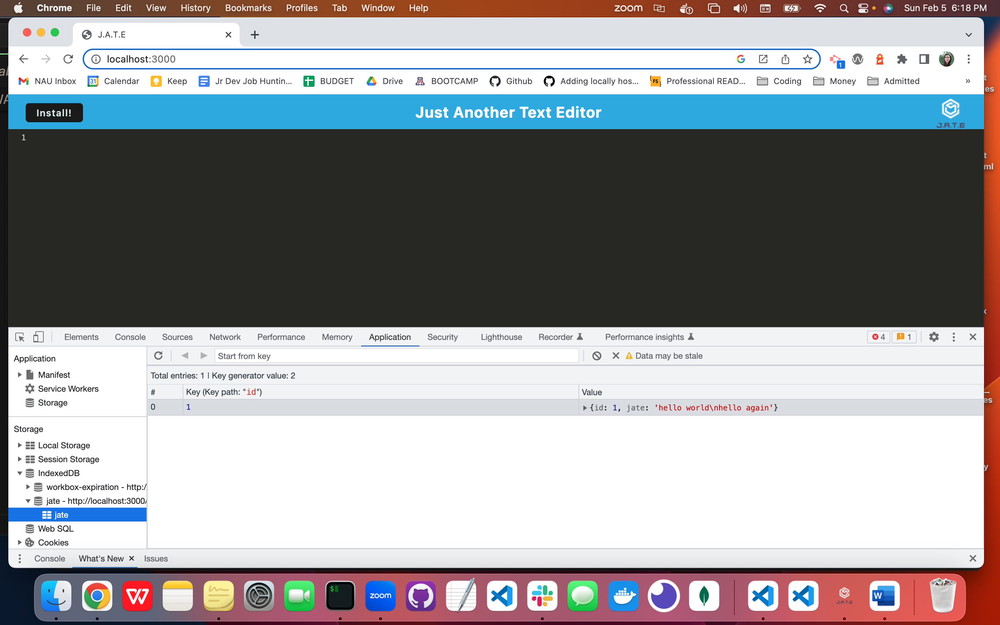
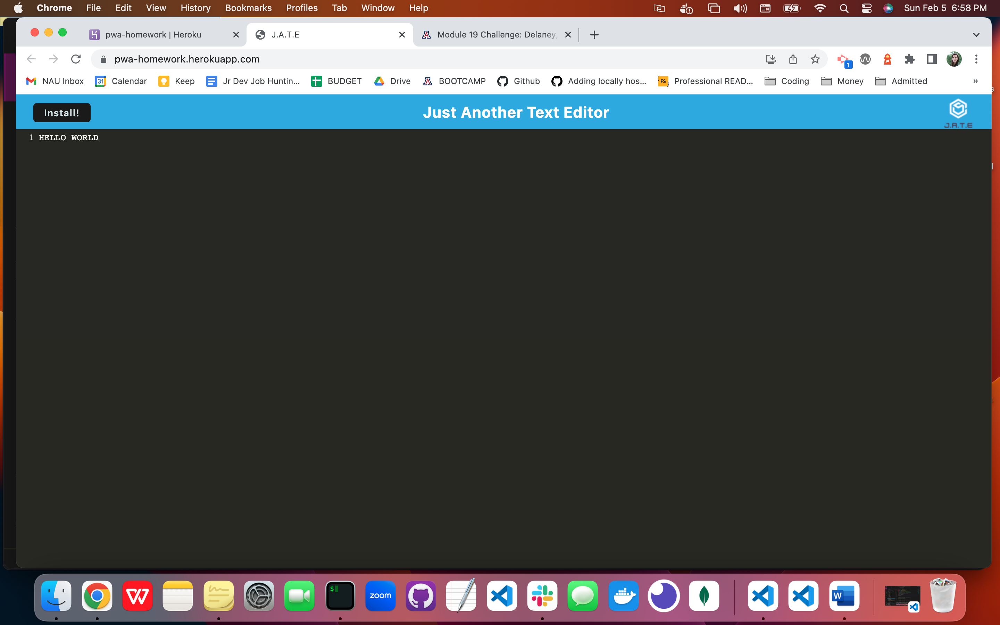

# PWA-Homework

## Description

Deplpyment Link: https://pwa-homework.herokuapp.com/

This homework project provided starter code to manipulate to meet the below acceptance criteria in the Usage section. The task was to build a text editor that runs in the browser, and will also function offline.

## Table of Contents

- [Installation](#installation)
- [Usage](#usage)
- [Credits](#credits)
- [License](#license)

## Installation

To begin, Node.js and multiple npm packages must be installed: express.js, Webpack, webpack-dev-server, WebpackPwaManifest, Babel, CSS-loader, Concurrently, and IndexedDB.

You will see a "dist" directory created which will contain your bundled json files.

## Usage

- GIVEN a text editor web application, WHEN I open my application in my editor, THEN I should see a client server folder structure

- WHEN I run `npm run start` from the root directory, THEN I find that my application should start up the backend and serve the client
- WHEN I run the text editor application from my terminal, THEN I find that my JavaScript files have been bundled using webpack
- WHEN I run my webpack plugins, THEN I find that I have a generated HTML file, service worker, and a manifest file

- WHEN I use next-gen JavaScript in my application, THEN I find that the text editor still functions in the browser without errors
- WHEN I open the text editor, THEN I find that IndexedDB has immediately created a database storage
- WHEN I enter content and subsequently click off of the DOM window, THEN I find that the content in the text editor has been saved with IndexedDB
- WHEN I reopen the text editor after closing it, THEN I find that the content in the text editor has been retrieved from our IndexedDB

- WHEN I click on the Install button, THEN I download my web application as an icon on my desktop

- WHEN I load my web application, THEN I should have a registered service worker using workbox

- WHEN I register a service worker, THEN I should have my static assets pre cached upon loading along with subsequent pages and static assets

- WHEN I deploy to Heroku, THEN I should have proper build scripts for a webpack application

## Credits

Nodejs
npm packages as follows: express, webpack, webpack-dev-server, webpack-pwa-manifest, babel, css-loader, concurrently, IndexedDB

## License

This project is licensed under the terms of the MIT license.